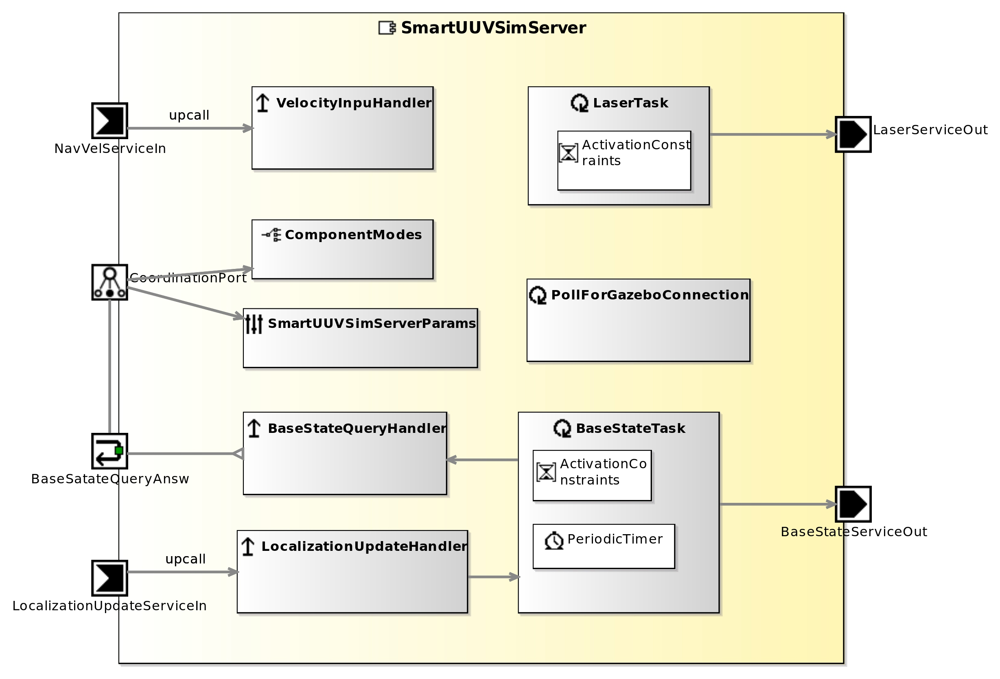

<!--- This file is generated from the SmartUUVSimServer.componentDocumentation model --->
<!--- do not modify this file manually as it will by automatically overwritten by the code generator, modify the model instead and re-generate this file --->

# SmartUUVSimServer Component

*Component Short Description:* The SmartUUVSimServer can be used to command an underwater robot in a 3D environment using the Gazebo simulator.

## Component Documentation

 The SmartUUVSimServer can be used to command an underwater robot in a 3D environment using the Gazebo simulator.

## Component-Datasheet Properties

<table style="border-collapse:collapse;">
<caption><i>Table:</i> Component-Datasheet Properties</caption>
<tr style="background-color:#ccc;">
<th style="border:1px solid black; padding: 5px;"><i>Property Name</i></th>
<th style="border:1px solid black; padding: 5px;"><i>Property Value</i></th>
<th style="border:1px solid black; padding: 5px;"><i>Property Description</i></th>
</tr>
<tr>
<td style="border:1px solid black; padding: 5px;">SpdxLicense</td>
<td style="border:1px solid black; padding: 5px;">Apache-2.0</td>
<td style="border:1px solid black; padding: 5px;">http://www.apache.org/licenses/LICENSE-2.0</td>
</tr>
<tr>
<td style="border:1px solid black; padding: 5px;">TechnologyReadinessLevel</td>
<td style="border:1px solid black; padding: 5px;">TRL5</td>
<td style="border:1px solid black; padding: 5px;"></td>
</tr>
<tr>
<td style="border:1px solid black; padding: 5px;">Homepage</td>
<td style="border:1px solid black; padding: 5px;">https://github.com/skarvtech/uwrosys/</td>
<td style="border:1px solid black; padding: 5px;"></td>
</tr>
<tr>
<td style="border:1px solid black; padding: 5px;">Supplier</td>
<td style="border:1px solid black; padding: 5px;">Skarv Technologies AS</td>
<td style="border:1px solid black; padding: 5px;"></td>
</tr>
<tr>
<td style="border:1px solid black; padding: 5px;">Purpose</td>
<td style="border:1px solid black; padding: 5px;">Simulation</td>
<td style="border:1px solid black; padding: 5px;"></td>
</tr>
</table>

## Component Ports

### NavVelServiceIn

*Documentation:*

### LocalizationUpdateServiceIn

*Documentation:*

### BaseSatateQueryAnsw

*Documentation:*

### LaserServiceOut

*Documentation:*

### BaseStateServiceOut

*Documentation:*

## Component Parameters: SmartUUVSimServerParams

### Internal Parameter: Settings

*Documentation:*

<table style="border-collapse:collapse;">
<caption><i>Table:</i> Internal Parameter <b>Settings</b></caption>
<tr style="background-color:#ccc;">
<th style="border:1px solid black; padding: 5px;"><i>Attribute Name</i></th>
<th style="border:1px solid black; padding: 5px;"><i>Attribute Type</i></th>
<th style="border:1px solid black; padding: 5px;"><i>Attribute Value</i></th>
<th style="border:1px solid black; padding: 5px;"><i>Attribute Description</i></th>
</tr>
<tr>
<td style="border:1px solid black; padding: 5px;"><b>sendVelTopic</b></td>
<td style="border:1px solid black; padding: 5px;">String</td>
<td style="border:1px solid black; padding: 5px;">"~/rexrov/vel_cmd"</td>
<td style="border:1px solid black; padding: 5px;"></td>
</tr>
<tr>
<td style="border:1px solid black; padding: 5px;"><b>basePoseTopic</b></td>
<td style="border:1px solid black; padding: 5px;">String</td>
<td style="border:1px solid black; padding: 5px;">"~/rexrov/pose_gt"</td>
<td style="border:1px solid black; padding: 5px;"></td>
</tr>
<tr>
<td style="border:1px solid black; padding: 5px;"><b>baseVelTopic</b></td>
<td style="border:1px solid black; padding: 5px;">String</td>
<td style="border:1px solid black; padding: 5px;">"~/rexrov::rexrov::base_footprint"</td>
<td style="border:1px solid black; padding: 5px;"></td>
</tr>
<tr>
<td style="border:1px solid black; padding: 5px;"><b>laserTopic</b></td>
<td style="border:1px solid black; padding: 5px;">String</td>
<td style="border:1px solid black; padding: 5px;">"~/rexrov/rexrov/base_footprint/base_laser/scan"</td>
<td style="border:1px solid black; padding: 5px;"></td>
</tr>
</table>

